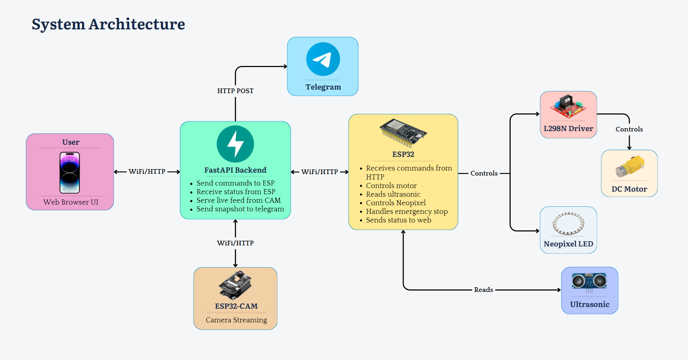
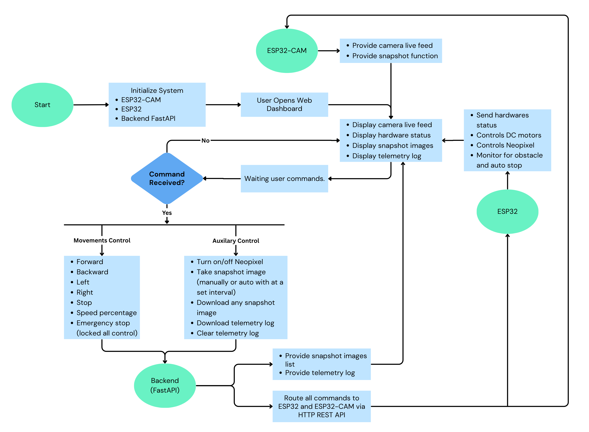

# Final Project: Remote Control Car with Headlight (Neopixel) + ESP32-CAM + Ultrasonic Sensor + Web Dashboard
## IOT Group 2
### Team Members:

Sunhout MORK

Chanveasna CHEN

Pichetroth SORITH

---

### [Link to Video](https://youtu.be/26dmMD6e5S0)

### 1. Introduction

This project implements a WiFi-controlled robotic car using an ESP32-based architecture. 
The system integrates real-time control, live video streaming, obstacle detection, and visual feedback via a web dashboard and Telegram notifications. 
The system is controlled remotely through a web dashboard with additional monitoring in Telegram.

#### 1.1 Hardware Components

| Component          | Description                                           |
| ------------------ | ----------------------------------------------------- |
| ESP32              | Main microcontroller handling logic and communication |
| ESP32-CAM          | Captures and streams live video                       |
| L298N Motor Driver | Controls direction and speed of DC motors             |
| DC Motors (x4)     | Enables movement of the car                           |
| Ultrasonic Sensor  | Measures distance for obstacle detection              |
| Neopixel LED       | Acts as a headlight and status indicator              |
| Power Supply       | Provides power to motors and controller               |

#### 1.2 Hardware Wiring 

---

### 2. Setup Guide

#### 2.1 Usage Instruction

1. Power on the system.
2. Connect to the same WiFi network.
3. Open the Web Dashboard in a browser.
4. Use controls to:
- Move the car (forward, backward, left, right)
- Toggle headlights (Neopixel)
5. Monitor:
- Live camera feed
- Distance readings
6. Receive alerts and snapshots via Telegram.

### 3. System Architecture

#### 3.1 System Overview
The system follows a client-server IoT architecture:

#### 3.2 System Flowchart

---
### 4. Design Decision

In this project, we made several important design choices to make the car simple, smart, safe, and easy to control. Below is a clear explanation of each decision.

#### 🔌 ESP32 + ESP32-CAM

We used two boards instead of one:

- ESP32 = the “brain” that controls the car
- ESP32-CAM = the “eyes” that see and send video

**Why this is good:**

- The ESP32 has built-in WiFi → no extra modules needed
- It is cheap and powerful enough for this project
- Using a separate camera avoids slowing down the main controller
- Large community → easier to fix problems

#### 🌐 Web-Based Control

Instead of making a mobile app, we used a web browser.

**Why we implemented it:**

- No need to install anything
- Works on phone, laptop, tablet
- Easy to update anytime
- Accessible from anywhere on the same network

#### 🚗 Differential Steering

The car moves using left and right wheels spinning at different speeds.

**Why we chose this method:**

- Simple design (no steering motor needed)
- Fewer parts → less chance of breaking
- Easy to control using software

#### 🛑 Obstacle Auto-Stop

We added an ultrasonic sensor to detect objects in front.

**Why we used an ultrasonic sensor:**

- Prevents crashing into walls or objects
- Improves safety
- Useful because the driver is remote and can’t feel distance

#### ✋ Emergency Stop & Lock

We added a manual stop button/system.

**Why we chose the manual method:**

- Stops the car instantly in dangerous situations
- Works even if sensors fail
- Adds an extra layer of safety

---

### 5. Challenges

- Synchronizing real-time control and video streaming
- Power distribution for motors vs microcontrollers
- Network latency affecting responsiveness
- Handling noisy ultrasonic sensor readings
- Ensuring stable WiFi communication

---

### 6. Limitations

- Limited range due to WiFi dependency
- Video streaming latency
- L298N inefficiency (heat and voltage drop)
- No autonomous navigation (manual control only)
- Battery life constraints

---

### 7. Future Improvements

- Replace L298N with more efficient motor driver (e.g., TB6612FNG)
- Add autonomous obstacle avoidance
- Implement mobile app (Flutter/React Native)
- Improve video streaming (WebRTC)
- Add GPS tracking
- Use machine learning for object detection

---

### 8. Conclusion

This project demonstrates a complete IoT-based robotic system integrating control, sensing, and real-time communication. 
It highlights practical challenges in embedded systems, networking, and hardware-software integration while providing a scalable 
foundation for future enhancements such as autonomy and AI integration.
