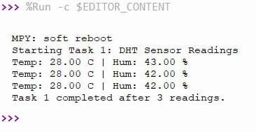
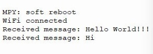

## IOT-Section 003-Group 2

# Lab 1: IoT Temperature Monitor & Relay Control (Telegram)

## 1. Project Overview
This project implements a smart IoT monitoring node using an **ESP32**, a **DHT22** sensor, and a **Relay Module**. The system provides real-time environmental monitoring with remote control capabilities via the Telegram Bot API.

---

## 2. Learning Outcomes
- Design and implement an IoT system using **MicroPython**.
- Apply periodic sampling and state-machine logic.
- Develop a chat-based remote control application.
- Evaluate system safety (relay isolation) and robustness.

---

## 3. Hardware Configuration
### Wiring Table
| Component | ESP32 Pin | Type |
| :--- | :--- | :--- |
| **DHT22 VCC** | 3.3V | Power |
| **DHT22 Data** | GPIO 4 | Input (Digital) |
| **DHT22 GND** | GND | Ground |
| **Relay VCC** | VIN (5V) | Power |
| **Relay IN** | GPIO 14 | Output (Control) |
| **Relay GND** | GND | Ground |

---

## 4. Tasks & Evidence

### Task 1: Sensor Read & Print
The DHT22 is sampled every 5 seconds. Data is formatted to 2 decimal places and printed to the serial console.
* **Evidence:** 

### Task 2: Telegram Send
Implementation of the `send_message()` function using `uRequests`. A test message was successfully posted to the Telegram group.
* **Evidence:** 

### Task 3: Bot Commands
The system processes incoming messages to handle the following:
- `/status`: Replies with current Temperature, Humidity, and Relay state.
- `/on`: Switches the relay ON manually.
- `/off`: Switches the relay OFF manually.
* **Evidence:** 

### Task 4: Threshold Logic & Alerts
- **State A:** $T < 30^{\circ}C$. System is silent.
- **State B:** $T \ge 30^{\circ}C$ and Relay is **OFF**. Alert sent every 5s.
- **State C:** User sends `/on`. Alerts stop even if $T \ge 30^{\circ}C$.
- **State D:** $T$ drops below $30^{\circ}C$. Relay turns **OFF** automatically + "Auto-OFF" notification.
* **Evidence:** [Link to Demo Video (60-90s)]

---

## 5. System Logic Flowchart

---

## 6. Robustness (Task 5)
- **Wi-Fi:** The system monitors the connection and auto-reconnects if the signal is dropped.
- **API Handling:** Telegram HTTP errors are caught via `try...except` to prevent script crashes.
- **Sensor Safety:** `DHT OSError` exceptions are handled by skipping the specific cycle rather than stopping the program.

---

## 7. How to Setup
1.  **Configure Credentials:** Update `main.py` with your Wi-Fi SSID, Password, Telegram Token, and Chat ID.
2.  **Upload Files:** Use Thonny to upload the code to the ESP32.
3.  **Run:** Reset the board and monitor the serial output for connection status.