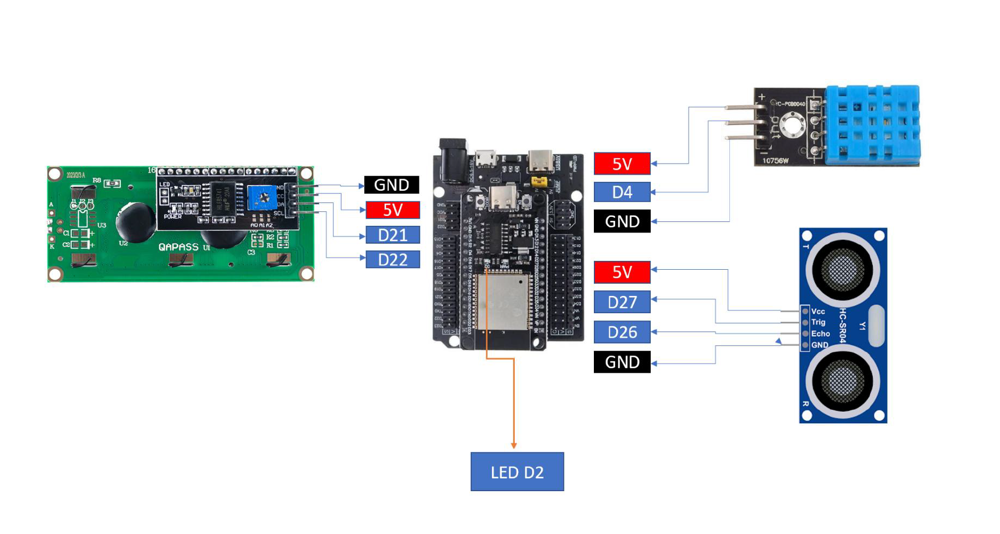
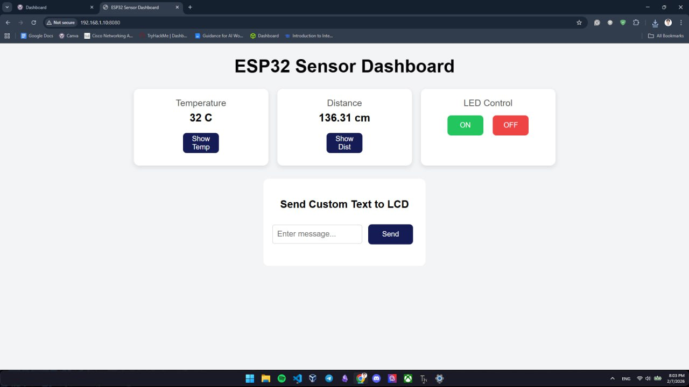
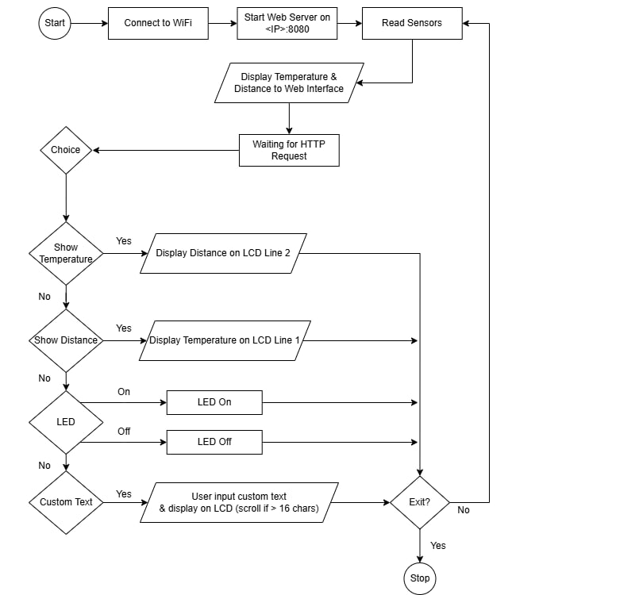

## IOT Group 2

# LAB2: IoT Webserver with LED, Sensors, and LCD Control

# ESP32 Web Server & Sensor Control Assignment

## 1. Project Overview

This project implements a web-based control and monitoring system using an **ESP32**.
The system allows users to control an LED, read sensor data, and display information on an LCD via a browser interface connected over Wi-Fi.

The project demonstrates integration of:

* ESP32 Web Server
* GPIO control
* DHT11 temperature sensor
* Ultrasonic distance sensor
* I2C LCD display
* Real-time browser interaction

---

## 2. Hardware Components

* ESP32 Dev Module
* DHT11 Temperature Sensor
* Ultrasonic Sensor (HC-SR04)
* I2C 16×2 LCD
* LED (GPIO2)
* Push Buttons (virtual, web-based)
* Breadboard & Jumper Wires

---

## 3. Wiring Diagram

**ESP32 Pin Connections:**

| Component       | ESP32 Pin |
| --------------- | --------- |
| LED             | GPIO2     |
| DHT11 Data      | GPIO23     |
| Ultrasonic TRIG | GPIO33     |
| Ultrasonic ECHO | GPIO34    |
| LCD SDA         | GPIO21    |
| LCD SCL         | GPIO22    |
| LCD VCC         | 5V        |
| LCD GND         | GND       |

**Evidence:**



---

## 4. Setup Instructions

### 4.1 Flashing & Running the Code

1. Install **MicroPython** on the ESP32.
2. Upload all project files to the ESP32.
3. Edit Wi-Fi credentials in `main.py`:

```python
ssid = "YOUR_WIFI_NAME"
password = "YOUR_WIFI_PASSWORD"
```

4. Reset the ESP32.
5. Check the **Serial Monitor** for the assigned IP address.
6. Open the IP address in a web browser.

---

## 5. Tasks & Evidence

### Task 1: LED Control (15 pts)

Two buttons (**ON** and **OFF**) are provided on the web page.
When clicked, the LED connected to **GPIO2** turns ON or OFF immediately.

**Evidence:**

[Link to LED Control Demo Video](https://drive.google.com/file/d/1B84hDKtzFPPIz-YVqmLzG3v_qyBJg7Xk/view?usp=sharing)  

---

### Task 2: Sensor Read (15 pts)

The ESP32 reads:

* **Temperature** from the DHT11 sensor
* **Distance** from the ultrasonic sensor

Sensor values are displayed on the web page and refreshed every **1–2 seconds**.

**Evidence:**



---

### Task 3: Sensor → LCD Display (20 pts)

Two buttons are added to the web interface:

* **Show Distance** → Displays distance on **LCD line 1**
* **Show Temp** → Displays temperature on **LCD line 2**

The LCD updates instantly after each button press.

**Evidence:**

[Sensor to LCD Display Video Demo](https://drive.google.com/file/d/1mK_48M7qsHQ5rU62LAmyKMq_8slERrKW/view?usp=sharing )


---

### Task 4: Textbox → LCD (20 pts)

A textbox and **Send** button allow the user to enter custom text from the browser.
The text is displayed on the LCD.
If the text exceeds **16 characters**, it scrolls automatically.

**Evidence:**

[Link to Textbox-to-LCD Demo Video](https://drive.google.com/file/d/1X9FJCtU55zQWfhlHr3nd1oqvAWNf5fDZ/view?usp=sharing)

---

### Flowchart


---

## 6. Usage Instructions

* **LED Control:**
  Click **ON** or **OFF** buttons on the web page.

* **Sensor Monitoring:**
  View live temperature and distance values on the web page.

* **LCD Display:**
  Use **Show Distance** or **Show Temp** buttons.

* **Custom Text:**
  Type text into the textbox and press **Send** to display it on the LCD.

---

## 7. Conclusion

This project successfully demonstrates real-time control and monitoring of hardware components using an ESP32 web server.
It integrates sensors, LCD output, and user interaction through a browser, fulfilling all assignment requirements.
