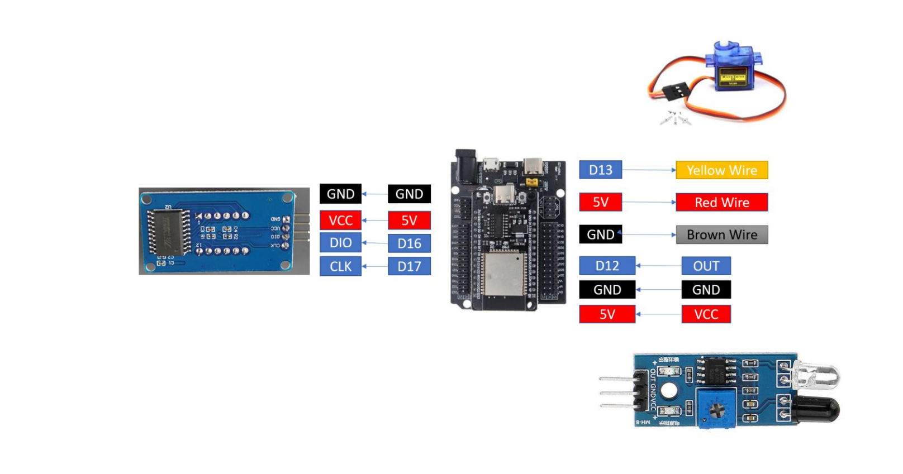
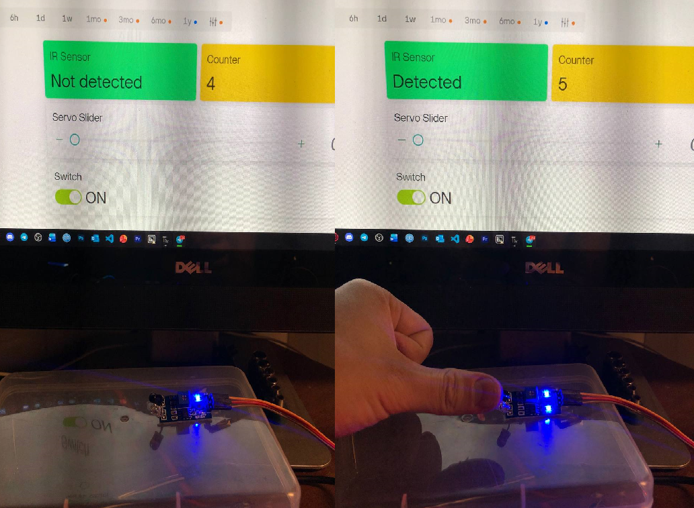
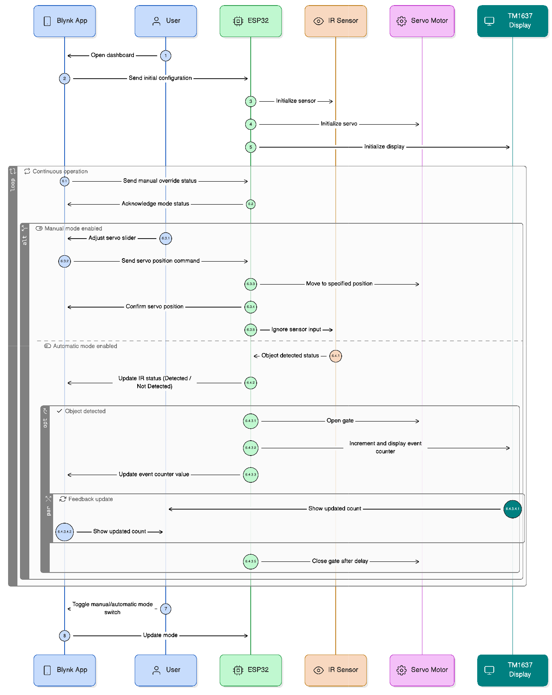

## IOT-Section 003-Group 2

# LAB 3: IoT Smart Gate Control with Blynk, IR Sensor, Servo Motor, and TM1637

--- 

## 1. Project Overview
This Project implements an ESP32-based IoT system using MicroPythonand the Blynk platform. 
The system integrates an IR sensor for object detection, a servo motor forphysical actuation, and a TM1637 7-segment display for real-time local feedback.

---

## 2. Learning Outcomes (CLO Alignment)
- Integrate multiple sensors and actuators into a single IoT system using ESP32.
- Use Blynk to remotely control hardware and visualize system status.
- Implement automatic and manual control logic based on sensor input and cloud commands.
- Display system status and numerical data using a TM1637 7-segment display.
- Document system wiring, logic flow, and IoT behavior clearly.

---

## 3. Hardware Configuration
### Hardware Component
* ESP32 Dev Board
* TM1637 4-Digit Display
* Servo Motor (SG90)
* IR Obstacle Avoidance Sensor
* Jumper Wires

### Wiring Table

**ESP32 Pin Connections:**

| Component         | Component Pin    | ESP32 Pin |
| :---------------- | :--------------- | :-------- |
| TM1637 Display    | CLK              | **D17**   |
|                   | DIO              | **D16**   |
|                   | VCC              | **5V**    |
|                   | GND              | **GND**   |
| Servo Motor       | Signal (Yellow)  | **D13**   |
|                   | 5V (Red)         | **5V**    |
|                   | GND (Brown)      | **GND**   |
| IP Sensor         | OUT              | **D12**   |
|                   | GND              | **GND**   |
|                   | VCC              | **VCC**   |

---

## 4. Tasks & Evidence

### Task 1: IR Sensor Reading
- Object Detection from IR Sensor
- Blynk for the web interface display of Detected/Not Detected

Evidence: 

---

### Task 2: Servo Motor Control via Blynk
- Servo Motor will move according to the angle control (0 - 180 degrees) via the slider control in the blynk web interface.
 
Evidence: [Link To Servo Slider Control Demo](https://youtube.com/shorts/Fi4Dmf5myhE?feature=share )

---

### Task 3: Automatic IR - Servo Action
- Object Detection from IR Sensor
- Servo Motor is used to show an example of an Open/Closed gate when IR Sensor Detects an object.

Evidence: [Link To IR & Servo Demo](https://youtube.com/shorts/IgS4cE8_J9g?feature=share )

---

### Task: 4 TM1637 Display Integration
- TM1637 to count the number of times the IR Sensor deteced an object
- The Blynk platform web interface will display the same number counted by TM1637 via its Label widget
  
Evidence: [Link To TM1637 Display Demo Video](https://youtube.com/shorts/eUVaTI0jt5s?feature=share )

---

### Task 5: Manual Override Mode
- On/Off for the manual mode from Blynk Switch widget in the web interface
- When the switch is **OFF**: *automatic mode* is switched to *manual mode*.
- When the switch is **ON**: *manual mode* is switched to *automatic mode*.

**Note**: *OFF* is **Manual Mode**, *ON* is **Automatic Mode**.

Evidence: [Link To The Manual Switch Demo](https://youtube.com/shorts/vH_d3Og69e4?feature=share )

---

### Flowchart

---

## 5. Conclusion
This project emphasizes interaction between sensors, actuators, cloud-based control, and localdisplay, reinforcing event-driven and IoT system design concepts.
