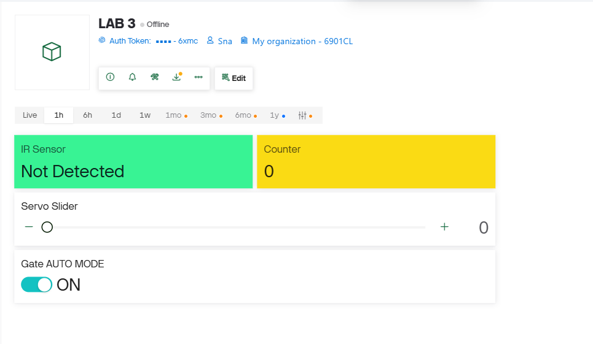
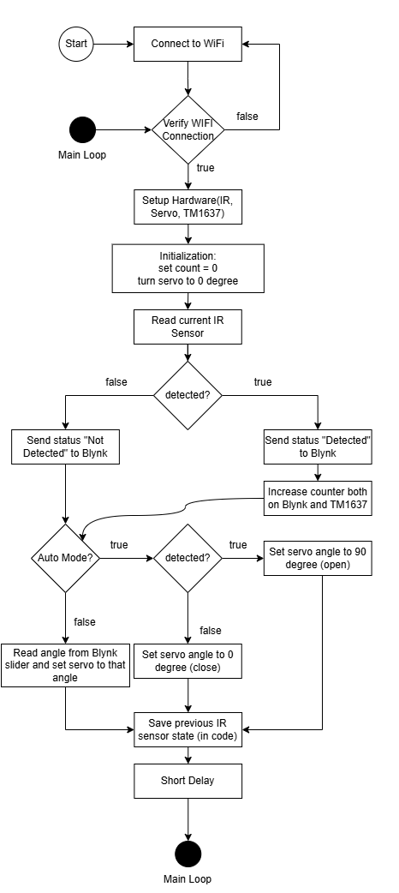

## IOT-Section 003-Group 2

# LAB 3: IoT Smart Gate Control with Blynk, IR Sensor, Servo Motor, and TM1637

--- 

## 1. Project Overview
This Project implements an ESP32-based IoT system using MicroPythonand the Blynk platform. 
The system integrates an IR sensor for object detection, a servo motor forphysical actuation, and a TM1637 7-segment display for real-time local feedback.

---

## 2. Learning Outcomes (CLO Alignment)
- Integrate multiple sensors and actuators into a single IoT system using ESP32.
- Use Blynk to remotely control hardware and visualize system status.
- Implement automatic and manual control logic based on sensor input and cloud commands.
- Display system status and numerical data using a TM1637 7-segment display.
- Document system wiring, logic flow, and IoT behavior clearly.

---

## 3. Hardware Configuration
### Hardware Component
* ESP32 Dev Board
* TM1637 4-Digit Display
* Servo Motor (SG90)
* IR Obstacle Avoidance Sensor
* Jumper Wires

### Wiring Table

**ESP32 Pin Connections:**

| Component         | Component Pin    | ESP32 Pin |
| :---------------- | :--------------- | :-------- |
| TM1637 Display    | CLK              | **D17**   |
|                   | DIO              | **D16**   |
|                   | VCC              | **5V**    |
|                   | GND              | **GND**   |
| Servo Motor       | Signal (Yellow)  | **D13**   |
|                   | 5V (Red)         | **5V**    |
|                   | GND (Brown)      | **GND**   |
| IR Sensor         | OUT              | **D12**   |
|                   | GND              | **GND**   |
|                   | VCC              | **VCC**   |


---

## 4. Setup Guide

### Step 1: Flash MicroPython to ESP32
1. Download the correct ESP32 MicroPython firmware.
2. Flash the firmware to the ESP32 board using Thonny, esptool, or another compatible tool.
3. Confirm the board can run MicroPython scripts.

### Step 2: Prepare the ESP32 File System
Upload the following file into ESP32 ```tm1637.py```
Which can be found at

```text
/esp32_module/tm1637.py
```

### Step 3: Upload the Main Program
Upload `main.py` to the root of the ESP32 file system.


### Step 4: Configure Wi-Fi and Blynk
Open `main.py` and update the configuration values:

```python
WIFI_SSID = "YOUR_WIFI_NAME"
WIFI_PASS = "YOUR_WIFI_PASSWORD"
BLYNK_TOKEN = "YOUR_BLYNK_AUTH_TOKEN"
```

Also verify the Blynk API URL and pin mapping used in the code.

### Step 5: Create the Blynk Dashboard
Create the required widgets in Blynk:

| Virtual Pin | Widget Type       | Purpose |
|-------------|-------------------|---------|
| V0          | Label / Display   | IR sensor status (`Detected` / `Not detected`) |
| V1          | Slider            | Manual servo control (0-180 degrees) |
| V2          | Numeric Display   | Detection counter |
| V3          | Switch            | Auto mode ON/OFF |

Recommended setup:
- **V1 Slider range:** `0` to `180`
- **V3 Switch:** `1 = Auto Mode`, `0 = Manual Mode`

### Step 7: Wire the Hardware
Connect the IR sensor, servo motor, and TM1637 display to the ESP32 according to your chosen pin mapping.
Double-check power and ground connections before powering on the board.

### Step 8: Run the Program
1. Reset or power on the ESP32.
2. Wait for the board to connect to Wi-Fi.
3. Open the Serial Console to verify connection messages.
4. Open the Blynk dashboard and confirm that the widgets update correctly.

---

## 5. Usage Instructions

### A. Power On and Connect
- Connect the ESP32 to power.
- Wait until the board connects to Wi-Fi.
- Confirm the Blynk dashboard is online.

### B. Automatic Mode
1. Set the **V3 switch to ON** to enable **Automatic Mode**.
2. Place an object in front of the IR sensor.
3. The system should:
   - send **Detected** status to Blynk,
   - move the servo to simulate gate opening,
   - count the detection event,
   - display the updated count on the **TM1637**,
   - send the same count to the **Blynk numeric display**.
4. Remove the object and the gate should return to the closed position according to the program logic.

### C. Manual Override Mode
1. Set the **V3 switch to OFF** to disable automatic mode.
2. Use the **V1 slider** to manually set the servo angle from **0 to 180 degrees**.
3. In manual mode, the IR sensor input is ignored for gate movement.

### D. Counter Behavior
- The detection counter increases when the IR sensor changes from **not detected** to **detected**.
- The value shown on the **TM1637 display** should match the value shown on **Blynk V2**.

### E. Expected Operating Modes Summary
| Mode | V3 Switch | Behavior |
|------|-----------|----------|
| Automatic Mode | ON (`1`) | IR sensor controls the servo automatically |
| Manual Mode    | OFF (`0`) | User controls the servo manually with slider V1 |

---

## 6. Tasks & Evidence

### Task 1: IR Sensor Reading
- Object Detection from IR Sensor
- Blynk for the web interface display of Detected/Not Detected

Evidence: 


---

### Task 2: Servo Motor Control via Blynk
- Servo Motor will move according to the angle control (0 - 180 degrees) via the slider control in the blynk web interface.
 
Evidence: [Link To Servo Slider Control Demo](https://youtube.com/shorts/Fi4Dmf5myhE?feature=share )

---

### Task 3: Automatic IR - Servo Action
- Object Detection from IR Sensor
- Servo Motor is used to show an example of an Open/Closed gate when IR Sensor Detects an object.

Evidence: [Link To IR & Servo Demo](https://youtube.com/shorts/IgS4cE8_J9g?feature=share )

---

### Task: 4 TM1637 Display Integration
- TM1637 to count the number of times the IR Sensor deteced an object
- The Blynk platform web interface will display the same number counted by TM1637 via its Label widget
  
Evidence: [Link To TM1637 Display Demo Video](https://youtube.com/shorts/eUVaTI0jt5s?feature=share )

---

### Task 5: Manual Override Mode
- On/Off for the manual mode from Blynk Switch widget in the web interface
- When the switch is **OFF**: *automatic mode* is switched to *manual mode*.
- When the switch is **ON**: *manual mode* is switched to *automatic mode*.

**Note**: *OFF* is **Manual Mode**, *ON* is **Automatic Mode**.

Evidence: [Link To The Manual Switch Demo](https://youtube.com/shorts/vH_d3Og69e4?feature=share )

### Screenshot of Blynk Dashboard

---

### Flowchart & Sequence Diagram



---

## 5. Conclusion
This project emphasizes interaction between sensors, actuators, cloud-based control, and localdisplay, reinforcing event-driven and IoT system design concepts.
