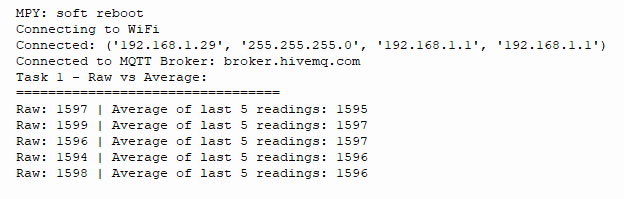
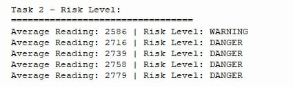
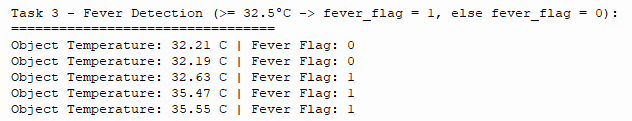
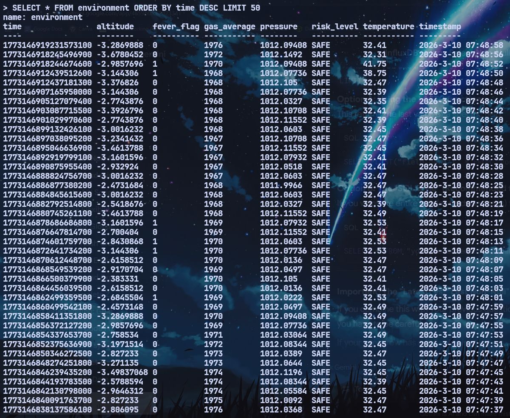
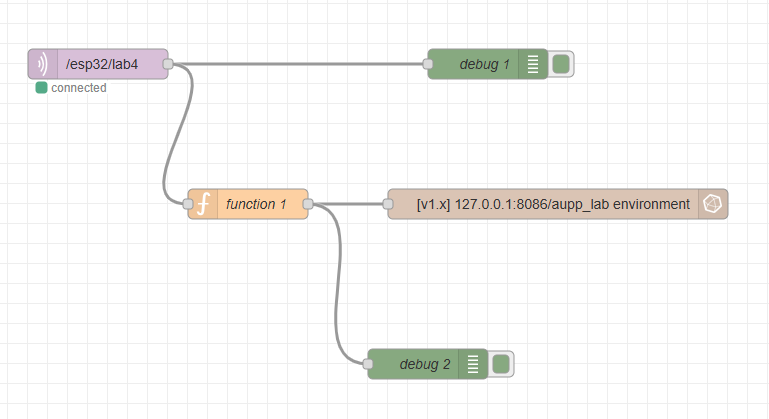
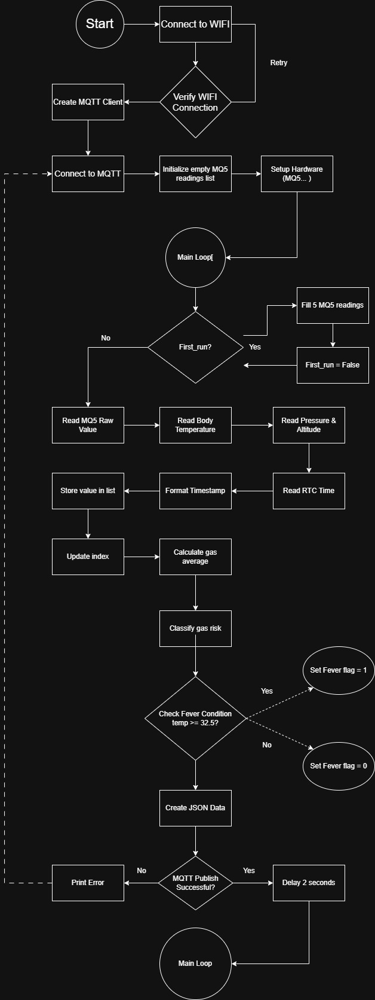

## IOT-Section 003-Group 2

# LAB 4: Multi-Sensor IoT Monitoring with Grafana Dashboard

--- 

## 1. Project Overview
This lab will design and implement a multi-sensor IoT monitoring system using
ESP32 and MicroPython (Thonny). The system integrates MLX90614 (body temperature),
MQ-5 (gas sensor), BMP280 (room temperature, pressure, altitude), and DS3231 (RTC).
Students must implement edge logic processing before sending data to Node-RED, where it
will be stored in InfluxDB and visualized in Grafana.

---

## 2. Learning Outcomes (CLO Alignment)
• Integrate multiple I2C and analog sensors with ESP32.
• Implement moving average filtering for noisy sensor signals.
• Create rule-based classification logic at the edge.
• Structure JSON packets for IoT transmission.
• Store time-series data in InfluxDB.
• Design dashboards using Grafana.

---

## 3. Hardware Configuration
### Hardware Component
The following hardware components are used in this lab:

1. **ESP32 Development Board**
2. **TCS34725 Color Sensor Module**
3. **NeoPixel RGB LED Ring (24 LEDs)**
4. **L298N Motor Driver Module**
5. **DC Motor**
6. **External power supply for the motor driver / motor**
7. **Jumper wires**
8. **USB cable for ESP32 programming and power**

### Wiring Table

**ESP32 Pin Connections:**

| Component  | Component Pin | ESP32 Pin |
|------------|---------------|-----------|
| BMP280     | SCL           | D22       |
|            | SDA           | D21       |
|            | VCC           | 3.3V      |
|            | GND           | GND       |
| DS3231     | SCL           | D22       |
|            | SDA           | D21       |
|            | VCC           | 5V        |
|            | GND           | GND       |
| MQ-5       | AO (Analog)   | D33       |
|            | GND           | GND       |
|            | VCC           | 5V        |
| MLX90614   | SCL           | D22       |
|            | SDA           | D21       |
|            | VCC           | 3.3V      |
|            | GND           | GND       |


---

## 4. Setup Guide

### 4.1 Software Prerequisites
Before running the project, prepare the following:

- **Thonny IDE** with ESP32 selected as the interpreter
- **MicroPython firmware** installed on the ESP32
- A working **Wi-Fi connection**
- Access to **Node-RED**, **InfluxDB**, and **Grafana**
- The required MicroPython files:
  - `main.py`
  - `bmp280.py`
  - `ds3231.py`
  - `mlx90614.py`

### 4.2 Upload prerequisite modules
This project depends on external MicroPython sensor drivers. Upload them to the ESP32 first.

1. Connect the ESP32 to your computer.
2. Open **Thonny**.
3. Go to **Run > Select interpreter** and choose **MicroPython (ESP32)**.
4. Open **View > Files** so you can see the ESP32 file system.
5. Upload these files:
   - `bmp280.py`
   - `ds3231.py`
   - `mlx90614.py`

### 4.3 Upload `main.py`
1. Open your lab source code in Thonny.
2. Save the program to the ESP32 as:
   ```
   main.py
   ```
3. Confirm that `main.py` is stored on the device.

### 4.4 Configure Wi-Fi and MQTT
Before running the code, edit these values in `main.py`:

```python
# ---------- WIFI ----------
SSID = "YOUR_WIFI_SSID"
PASSWORD = "YOUR_WIFI_PASSWORD"

# ---------- MQTT ----------
MQTT_BROKER = "MQTT_BROKER_ADDRESS"
CLIENT_ID = "YOUR_MQTT_CLIENT_ID" # Can use whatever
TOPIC = "YOUR_TOPIC"
```

Default project communication values used in the code:

- MQTT Broker: `broker.hivemq.com`
- Topic: `/esp32/lab4`

### 4.5 Prepare the backend
Make sure your backend pipeline is ready:

1. **Node-RED** subscribes to the MQTT topic.
2. Node-RED parses the JSON payload from the ESP32.
3. Node-RED writes the fields into **InfluxDB**.
4. **Grafana** reads the stored data from InfluxDB.

### 4.6 Final pre-run checklist
Before powering the system, confirm that:

- All sensor wiring matches the pin table above.
- The ESP32 is connected to Wi-Fi.
- `bmp280.py`, `ds3231.py`, and `mlx90614.py` are uploaded into ESP32
- Node-RED, InfluxDB, and Grafana are running.
- The **DS3231 time is set correctly** so timestamps are valid.

---

## 5. Usage Instructions and Simple System Logic

### 5.1 How to run the system
1. Power the ESP32 and open the **Serial Monitor** in Thonny.
2. The ESP32 connects to Wi-Fi.
3. The ESP32 connects to the MQTT broker.
4. The system starts reading data from all connected sensors.
5. Processed sensor data is published to MQTT.
6. Node-RED receives the data and stores it in InfluxDB.
7. Grafana displays the data in dashboard panels.

### 5.2 Simple system logic explanation
The system follows this basic logic:

1. **Read MQ-5 gas sensor value** using the ESP32 ADC.
2. Store the **last 5 gas readings**.
3. Compute the **moving average** of those 5 readings.
4. Classify the gas level using these rules:
   - `< 2100` → **SAFE**
   - `2100–2599` → **WARNING**
   - `>= 2600` → **DANGER**
5. **Read MLX90614 body temperature**.
6. Apply fever logic:
   - `body_temp >= 32.5°C` → `fever_flag = 1`
   - otherwise → `fever_flag = 0`
7. **Read BMP280 pressure and altitude**.
8. **Read DS3231 timestamp**.
9. Combine all processed values into **one JSON data packet**.
10. Publish the JSON packet to MQTT for Node-RED and Grafana.

### 5.3 Example JSON payload
A typical published payload looks like this:

```json
{
  "average": 2245,
  "risk_level": "WARNING",
  "temperature": 33.1,
  "fever_flag": 1,
  "pressure": 1008.7,
  "altitude": 41.2,
  "timestamp": "2026-03-10 21:15:42"
}
```

### 5.4 Expected dashboard outputs
The Grafana dashboard should include the following panels:

1. **Gas Average** (Time Series)
2. **Risk Level Display**
3. **Body Temperature Gauge**
4. **Pressure Graph**
5. **Altitude Graph**
6. **Pressure value (hPa)** from BMP280
7. **Altitude value (meters)**
8. **DS3231 timestamp**

### 5.5 Serial monitor behavior
When the program is running correctly, the Serial Monitor should show:

- Wi-Fi connection progress
- MQTT connection confirmation
- Raw/processed sensor activity during testing
- Published JSON messages

This is especially useful for showing:
- raw vs averaged gas readings
- different gas risk states
- fever detection behavior

---

## 6. Tasks & Evidence

### Task 1: Gas Filtering (Moving Average)

* **Implementation**: Used a buffer of 5 readings (NUM_READINGS = 5) to calculate a rolling average of the MQ-5 signal.

* **Result**: Effectively smoothed raw ADC spikes, providing a stable input for risk classification.

**Evidence**: 



---

### Task 2: Gas Risk Classification

* **Logic**: Created classify_gas() function using thresholds: <2100 (Safe), 2100-2600 (Warning), and >2600 (Danger).

* **Edge Processing**: Translates raw sensor data into actionable status strings before transmission.
 
**Evidence**: 



---

### Task 3: Fever Detection Logic

* **Logic**: Built fever_detection() to flag temperatures $\ge$ 32.5°C as a potential fever 
(Value: 1).

* **Integration**: Combines MLX90614 object temperature with real-time timestamps from the DS3231 RTC.

**Evidence**:



---

### Task 4: Pressure & Altitude Monitoring (Grafana)

* **Pipeline**: Streamed BMP280 pressure and altitude data via MQTT to a Node-RED and InfluxDB backend.

* **Visualization**: Developed a Grafana Dashboard to track atmospheric trends and sensor health in real-time.
  
### Evidence: Screenshot of Grafana Dashboard


---
### Screenshot of InfluxDB Data


### Screenshot of Node-Red Flow

### Flowchart & Sequence Diagram



---

### Demo Video

[Link to demo video](https://drive.google.com/file/d/1Hff3KdLtuQ_uu7cJDV-KtgqdPHpUUYyv/view?usp=sharing)

---
## 7. Conclusion

This lab successfully demonstrated the integration of a multi-sensor IoT ecosystem using the ESP32. By implementing Moving Average filtering and threshold-based classification at the edge, we reduced data noise and offloaded processing from the cloud. The seamless data pipeline—from MicroPython via MQTT to InfluxDB—allowed for high-fidelity visualization in Grafana, proving the effectiveness of real-time environmental and health monitoring in a unified dashboard.
