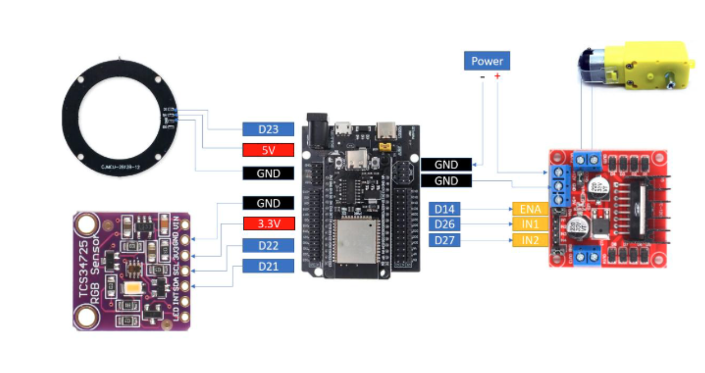
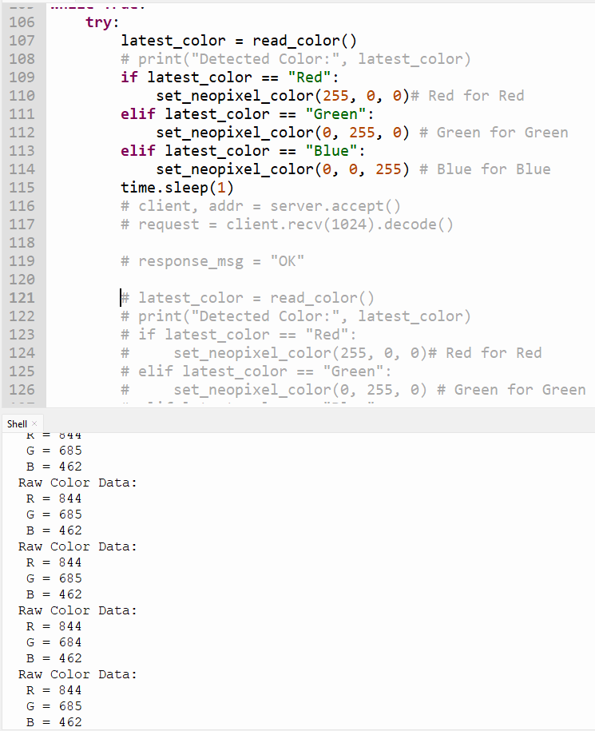

## IOT-Section 003-Group 2

# LAB 5: Smart Color Detection & Control with MIT App

--- 

## 1. Project Overview
This project implements a **Smart Color Detection & Control System** using **ESP32 and MicroPython**. The system integrates:

- **TCS34725 Color Sensor** (detect RGB values)  
- **NeoPixel RGB LED** (visual feedback)  
- **DC Motor** (controlled using PWM)  

The ESP32 processes color data locally (edge computing) and performs actions based on detected colors. Additionally, the system connects to a **MIT App Inventor mobile app** for:

- Real-time color monitoring  
- Manual motor control  
- Manual RGB LED control  

---

## 2. Learning Outcomes (CLO Alignment)

- Integrate **I2C sensor (TCS34725)** with ESP32  
- Implement **rule-based color classification logic**  
- Control **NeoPixel LED using RGB values**  
- Control **DC motor speed using PWM**  
- Design a **mobile app using MIT App Inventor**  
- Combine **automatic and manual control systems**  

---

## 3. Hardware Configuration
### Hardware Component

## Wiring Table

### ESP32 Pin Connections:

| Component        | Component Pin | ESP32 Pin |
|-----------------|--------------|----------|
| TCS34725        | SCL          | D22      |
|                 | SDA          | D21      |
|                 | VCC          | 3.3V     |
|                 | GND          | GND      |
| NeoPixel        | DIN          | D23      |
|                 | VCC          | 5V       |
|                 | GND          | GND      |
| DC Motor Driver | IN1          | D27      |
|                 | IN2          | D26      |
|                 | ENA (PWM)    | D14      |
|                 | VCC          | 5V       |
|                 | GND          | GND      |

---

## 4. Tasks & Evidence

### Task 1: RGB Reading  
Display RGB values from TCS34725 sensor  

**Evidence:**  

---

### Task 2: Color Classification  
System correctly identifies Red, Green, and Blue  

**Evidence:**  
[Link to Video](https://drive.google.com/file/d/11NlFiE391vVvemMUtXTsbc3KDb-7Ffg1/view?usp=sharing)
---

### Task 3: NeoPixel Control  
NeoPixel changes color based on detected color  

**Evidence:**   
[Link to Video](https://drive.google.com/file/d/103AEgVJQKOoPsGvUJQRk-qkrZT7f4hSl/view?usp=sharing)
---

### Task 4: Motor Control (PWM)  
Motor speed changes based on detected color  

- RED → PWM = 700  
- GREEN → PWM = 500  
- BLUE → PWM = 300  

**Evidence:**  
[Link to Video](https://drive.google.com/file/d/1lTSH2_OohvFQVbyLHheorYl57zOgr-Ex/view?usp=sharing)
---

### Task 5: MIT App Integration  
App features:
- Display detected color  
- Motor control buttons (Forward, Stop, Backward)  
- RGB input for manual LED control  

**Evidence:**  
[Link to Video](https://drive.google.com/file/d/1St8xNKb4f5ZJZmdtU5NFf-mWKfhDcuME/view?usp=sharing)
---
 
### Flowchart & Sequence Diagram

---
## 5. Conclusion
This project demonstrates how IoT systems can combine **sensor data, edge processing, and mobile applications** to create intelligent control systems.

We successfully:
- Integrated hardware components with ESP32  
- Implemented real-time color detection  
- Controlled LED and motor outputs  
- Built a mobile interface for user interaction  

This lab enhances understanding of **IoT architecture, automation, and human-device interaction**.

---

