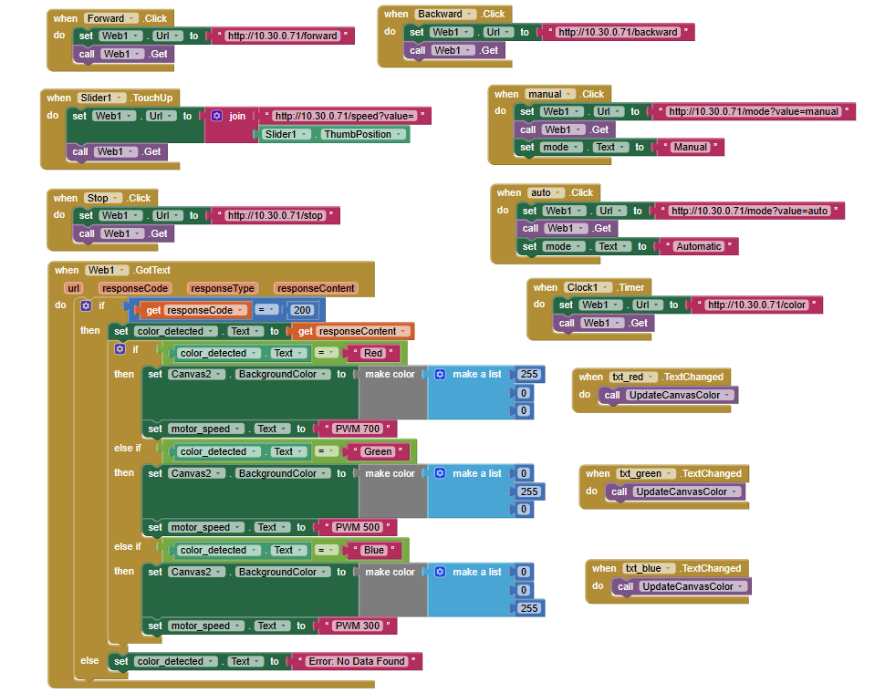
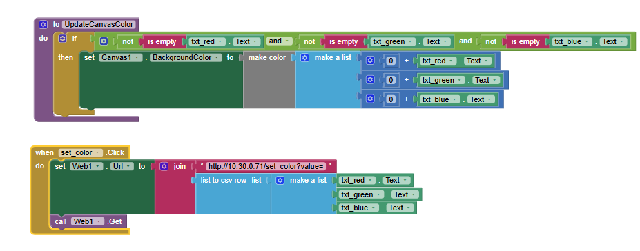
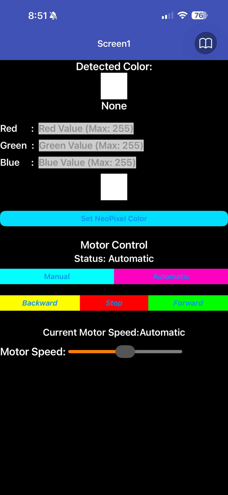

## IOT-Section 003-Group 2

# LAB 5: Smart Color Detection & Control with MIT App

--- 

## 1. Project Overview
This project implements a **Smart Color Detection & Control System** using **ESP32 and MicroPython**. The system integrates:

- **TCS34725 Color Sensor** (detect RGB values)  
- **NeoPixel RGB LED** (visual feedback)  
- **DC Motor** (controlled using PWM)  

The ESP32 processes color data locally (edge computing) and performs actions based on detected colors. Additionally, the system connects to a **MIT App Inventor mobile app** for:

- Real-time color monitoring  
- Manual motor control  
- Manual RGB LED control  

---

## 2. Learning Outcomes (CLO Alignment)

- Integrate **I2C sensor (TCS34725)** with ESP32  
- Implement **rule-based color classification logic**  
- Control **NeoPixel LED using RGB values**  
- Control **DC motor speed using PWM**  
- Design a **mobile app using MIT App Inventor**  
- Combine **automatic and manual control systems**  


---

## 3. Hardware Configuration
### Hardware Component
The following hardware components are used in this lab:

1. **ESP32 Development Board**
2. **TCS34725 Color Sensor Module**
3. **NeoPixel RGB LED Ring (24 LEDs)**
4. **L298N Motor Driver Module**
5. **DC Motor**
6. **External power supply for the motor driver / motor**
7. **Jumper wires**
8. **USB cable for ESP32 programming and power**

## Wiring Table

### ESP32 Pin Connections:

| Component        | Component Pin | ESP32 Pin |
|-----------------|--------------|----------|
| TCS34725        | SCL          | D22      |
|                 | SDA          | D21      |
|                 | VCC          | 3.3V     |
|                 | GND          | GND      |
| NeoPixel        | DIN          | D23      |
|                 | VCC          | 5V       |
|                 | GND          | GND      |
| DC Motor Driver | IN1          | D27      |
|                 | IN2          | D26      |
|                 | ENA (PWM)    | D14      |
|                 | VCC          | None (Power Supply 12V)       |
|                 | GND          | GND      |


---

## 4. Setup Guide

### 4.1 Software Needed
- **Thonny IDE**
- **MicroPython firmware installed on ESP32**
- `main.py`
- `tcs34725.py` driver file uploaded to the ESP32

### 4.2 Hardware Setup
1. Connect all hardware according to the wiring table above.
2. Make sure the motor driver has its own proper external motor supply.
3. Make sure all GND lines are connected together.

### 4.3 ESP32 Setup in Thonny
1. Flash MicroPython to the ESP32 if not already installed.
2. Open **Thonny**.
3. Connect the ESP32 using USB.
4. Upload these files to the ESP32:
   - `main.py`
   - `tcs34725.py`
5. Edit the Wi-Fi credentials inside `main.py`:

```python
ssid = "YOUR_WIFI_NAME"
password = "YOUR_WIFI_PASSWORD"
```

6. Run `main.py`.
7. Open the serial shell and wait for:
   - Wi-Fi connected message
   - ESP32 IP address
   - `Server running on port 80...`

### 4.4 MIT App Inventor Setup
The MIT App should send HTTP GET requests to the ESP32 IP address.

Example base URL:

```text
http://<ESP32_IP>
```

Example endpoints:

```text
/color
/mode?value=auto
/mode?value=manual
/forward
/backward
/stop
/speed?value=500
/set_color?value=255,0,0
```

### 4.5 MIT App Block




---

## 5. System Behavior Summary
The system can be understood as two modes:

### Automatic Mode
1. The app switches the ESP32 to `auto` mode.
2. The ESP32 uses the latest classified color.
3. It changes the NeoPixel ring color to match the detected color.
4. It drives the motor forward at a color-based PWM speed.

### Manual Mode
1. The app sends manual control commands.
2. The ESP32 ignores color-based automatic behavior.
3. The user can:
   - move motor forward,
   - move motor backward,
   - stop the motor,
   - set RGB color manually,
   - set speed manually.

---

## 6. Tasks & Evidence

### Task 1: RGB Reading  
Display RGB values from TCS34725 sensor  

Evidence:


---

### Task 2: Color Classification  
System correctly identifies Red, Green, and Blue  

Evidence: 
[Link to Video](https://drive.google.com/file/d/11NlFiE391vVvemMUtXTsbc3KDb-7Ffg1/view?usp=sharing)
---

### Task 3: NeoPixel Control  
NeoPixel changes color based on detected color  

Evidence: 
[Link to Video](https://drive.google.com/file/d/103AEgVJQKOoPsGvUJQRk-qkrZT7f4hSl/view?usp=sharing)
---

### Task 4: Motor Control (PWM)  
Motor speed changes based on detected color  

- RED → PWM = 700  
- GREEN → PWM = 500  
- BLUE → PWM = 300  

Evidence: 
[Link to Video](https://drive.google.com/file/d/1lTSH2_OohvFQVbyLHheorYl57zOgr-Ex/view?usp=sharing)
---

### Task 5: MIT App Integration  
App features:
- Display detected color  
- Motor control buttons (Forward, Stop, Backward)  
- RGB input for manual LED control  

Evidence:



Video: [Link to Video](https://drive.google.com/file/d/1St8xNKb4f5ZJZmdtU5NFf-mWKfhDcuME/view?usp=sharing)
---
 
### Flowchart & Sequence Diagram


---
## 5. Conclusion
This project demonstrates how IoT systems can combine **sensor data, edge processing, and mobile applications** to create intelligent control systems.

We successfully:
- Integrated hardware components with ESP32  
- Implemented real-time color detection  
- Controlled LED and motor outputs  
- Built a mobile interface for user interaction  

This lab enhances understanding of **IoT architecture, automation, and human-device interaction**.

---

