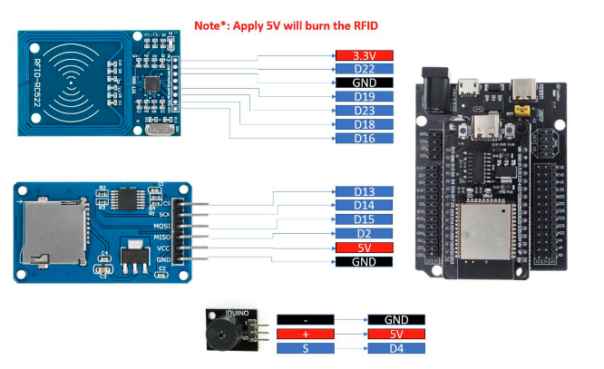
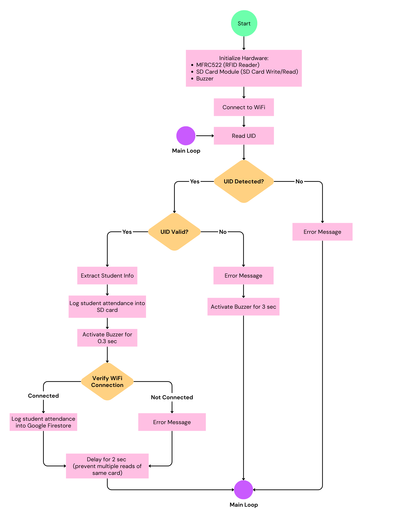

## IOT-Section 003-Group 2

# LAB 6: Smart RFID System with Cloud & SD Logging

--- 

## 1. Project Overview
This lab will design and implement a **smart RFID-based attendance system** using
ESP32 and MicroPython (Thonny). The system identifies users, logs attendance locally and remotely, and
provides real-time feedback. The system integrates: 
- **RFID-RC522**
- **SD card**
- **Firestore**
- **a buzzer**

---

## 2. Learning Outcomes (CLO Alignment)

- Integrate SPI-based **RFID sensor (RC522)** with ESP32
- Implement **UID-based identification system**
- Design structured **data storage** (CSV format)
- Store data locally **(SD card)** and remotely **(Firestore)**
- Implement real-time feedback using **buzzer**
- Apply system integration across multiple modules

---

## 3. Hardware Configuration
### Hardware Component
The following hardware components are used in this lab:

1. **ESP32 Development Board**
2. **RFID sensor (RC522)**
3. **Micro SD Card Adapter**
4. **Buzzer**
5. **Jumper wires**
6. **USB cable for ESP32 programming and power**

## Wiring Table

### ESP32 Pin Connections:

| Component        | Component Pin | ESP32 Pin |
|-----------------|--------------|----------|
| RFID Sensor     | SDA          | D16      |
|                 | SCK          | D18      |
|                 | MOSI         | D23      |
|                 | MISO         | D19      |
|                 | GND          | GND      |
|                 | RST          | D22      |
|                 | VCC          | 3.3V     |
| SD Card Adapter | CS           | D13      |
|                 | SCK          | D14      |
|                 | MOSI         | D15      |
|                 | MISO         | D2       |
|                 | VCC          | 5V       |
|                 | GND          | GND      |
| Buzzer          | -            | GND      |
|                 | +            | 5V       |
|                 | S            | D4       |

---

## 4. Tasks & Evidence

### Task 1: Read UID from RFID card  
Detect card and retrieve its unique ID (UID) 

---

### Task 2: Match UID with student database  
Compare UID with predefined data
- If found -> valid student
- If not -> unknown card 

---

### Task 3: Generate current datetime
- Format: YYYY-MM-DD HH:MM:SS

---

### Task 4: UID Valid Detection  
If UID is valid:
- Activate buzzer for 0.3 seconds
- Save data to SD card (CSV format):
UID, Name, StudentID, Major, DateTime
- Send data to Firestore 

---

### Task 5: UID Invalid Detection
If UID is invalid:
- Activate buzzer for 3 seconds
- Display: "Unknown Card"
- Do not save or send data  

Video: [Link to Video](https://drive.google.com/file/d/1uIVsW3y-K32KHLIOYW1Y-2VShP13MvHc/view?usp=sharing)
---
 
### Flowchart & Sequence Diagram

---
## 5. Conclusion

In conclusion, the successful implementation of this Smart RFID-based System demonstratd the effective integration of local hardware control with cloud-based data management. By leveraging the ESP32 and MicroPython, the system achieves a reliable balance between real-time edge processing, such as UID identification and local SD card logging and remote synchronization via Firestore.

---

