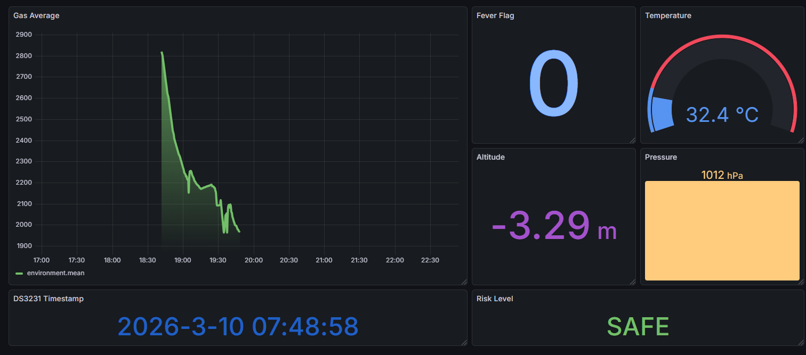
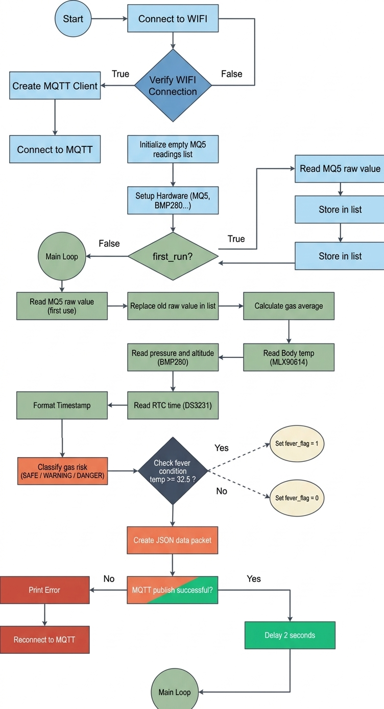

## IOT-Section 003-Group 2

# LAB 4: Multi-Sensor IoT Monitoring with Grafana Dashboard

--- 

## 1. Project Overview
This lab will design and implement a multi-sensor IoT monitoring system using
ESP32 and MicroPython (Thonny). The system integrates MLX90614 (body temperature),
MQ-5 (gas sensor), BMP280 (room temperature, pressure, altitude), and DS3231 (RTC).
Students must implement edge logic processing before sending data to Node-RED, where it
will be stored in InfluxDB and visualized in Grafana.

---

## 2. Learning Outcomes (CLO Alignment)
• Integrate multiple I2C and analog sensors with ESP32.
• Implement moving average filtering for noisy sensor signals.
• Create rule-based classification logic at the edge.
• Structure JSON packets for IoT transmission.
• Store time-series data in InfluxDB.
• Design dashboards using Grafana.

---

## 3. Hardware Configuration
### Hardware Component

### Wiring Table

**ESP32 Pin Connections:**

| Component  | Component Pin | ESP32 Pin |
|------------|---------------|-----------|
| BMP280     | SCL           | D22       |
|            | SDA           | D21       |
|            | VCC           | 3.3V      |
|            | GND           | GND       |
| DS3231     | SCL           | D22       |
|            | SDA           | D21       |
|            | VCC           | 5V        |
|            | GND           | GND       |
| MQ-5       | AO (Analog)   | D33       |
|            | GND           | GND       |
|            | VCC           | 5V        |
| MLX90614   | SCL           | D22       |
|            | SDA           | D21       |
|            | VCC           | 3.3V      |
|            | GND           | GND       |

---

## 4. Tasks & Evidence

### Task 1: Gas Filtering (Moving Average)

* **Implementation**: Used a buffer of 5 readings (NUM_READINGS = 5) to calculate a rolling average of the MQ-5 signal.

* **Result**: Effectively smoothed raw ADC spikes, providing a stable input for risk classification.

**Evidence**: 

---

### Task 2: Gas Risk Classification

* **Logic**: Created classify_gas() function using thresholds: <2100 (Safe), 2100-2600 (Warning), and >2600 (Danger).

* **Edge Processing**: Translates raw sensor data into actionable status strings before transmission.
 
**Evidence**: 

---

### Task 3: Fever Detection Logic

* **Logic**: Built fever_detection() to flag temperatures $\ge$ 32.5°C as a potential fever 
(Value: 1).

* **Integration**: Combines MLX90614 object temperature with real-time timestamps from the DS3231 RTC.

**Evidence**:

---

### Task 4: Pressure & Altitude Monitoring (Grafana)

* **Pipeline**: Streamed BMP280 pressure and altitude data via MQTT to a Node-RED and InfluxDB backend.

* **Visualization**: Developed a Grafana Dashboard to track atmospheric trends and sensor health in real-time.
  
**Evidence**: 

---

### Flowchart & Sequence Diagram

---

### Demo Video

[Link to demo video](https://drive.google.com/file/d/1Hff3KdLtuQ_uu7cJDV-KtgqdPHpUUYyv/view?usp=sharing)

---
## 5. Conclusion

This lab successfully demonstrated the integration of a multi-sensor IoT ecosystem using the ESP32. By implementing Moving Average filtering and threshold-based classification at the edge, we reduced data noise and offloaded processing from the cloud. The seamless data pipeline—from MicroPython via MQTT to InfluxDB—allowed for high-fidelity visualization in Grafana, proving the effectiveness of real-time environmental and health monitoring in a unified dashboard.
