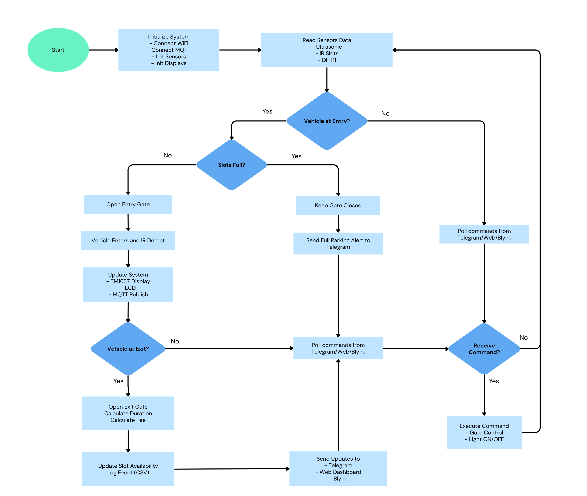

# Smart IoT Parking Management System

## Project Overview
This project implements a **Smart IoT Parking Management System** using **ESP32 with MicroPython**, integrated with multiple sensors, actuators, and IoT platforms.

The system automates parking operations by:
- Detecting incoming vehicles
- Managing parking slot availability
- Controlling entry/exit gates
- Monitoring environmental conditions
- Providing real-time control and monitoring via **Telegram, Web Dashboard, and Blynk**

---

## Objectives
- Design a complete embedded IoT system  
- Integrate hardware with cloud platforms  
- Enable real-time monitoring and automation  
- Apply system-level engineering concepts  
- Develop a scalable and modular architecture  

---

## Hardware Description

| Component              | GPIO Pin(s)         | Description                                      |
|------------------------|---------------------|--------------------------------------------------|
| Ultrasonic (Entry)     | TRIG: 33, ECHO: 32 | Detect vehicle at entry                           |
| Ultrasonic (Exit)      | TRIG: 5, ECHO: 18  | Detect vehicle at exit                            |
| Servo Motor (Entry)    | 16                 | Controls entry gate                               |
| Servo Motor (Exit)     | 12                 | Controls exit gate                                |
| IR Sensor - Slot 1     | 14                 | Detect occupancy of parking slot 1                |
| IR Sensor - Slot 2     | 27                 | Detect occupancy of parking slot 2                |
| IR Sensor - Slot 3     | 26                 | Detect occupancy of parking slot 3                |
| IR Sensor - Slot 4     | 25                 | Detect occupancy of parking slot 4                |
| LED                    | 2                  | Parking light indicator                           |
| DHT11                  | 4                  | Temperature & humidity sensor                     |
| TM1637 Display         | CLK: 19, DIO: 23   | Displays available parking slots                  |
| LCD I2C                | SCL: 22, SDA: 21   | Displays system messages/status                   |

---

## System Architecture

The system follows a **three-layer architecture**.

### 1) Device Layer
The ESP32 is connected directly to all field devices:
- entry ultrasonic sensor
- exit ultrasonic sensor
- four IR slot sensors
- two servo motors
- DHT11
- TM1637 display
- LCD display
- LED output

The ESP32 handles all time-sensitive logic locally so the parking system can keep operating even if the user is not actively watching the dashboard.

### 2) Communication Layer
MQTT is the message bridge between the ESP32 and the backend.

#### MQTT topic structure
- `smartparking/{site}/{device}/state`
- `smartparking/{site}/{device}/event/...`
- `smartparking/{site}/{device}/control`

#### Message direction
- **ESP32 → Backend**: state updates, gate events, slot events, ultrasonic presence events, heartbeat, parking full alert, LED status
- **Backend → ESP32**: control commands for gates and LED

### 3) Application Layer
The FastAPI backend sits above MQTT and provides:
- web dashboard rendering
- REST API endpoints
- Telegram bot polling and command forwarding
- Blynk polling and widget synchronization
- in-memory live state tracking
- CSV event logging

### High-level System Architecture Diagram


### Flowchart 


---

## Software Architecture

### ESP32 firmware (`modules/esp_firmware.py`)
The ESP32 firmware is the core runtime engine. Its responsibilities are:
- connect to Wi-Fi
- connect and subscribe to MQTT control topic
- initialize all sensors, servos, displays, and LED
- debounce IR sensors for stable slot detection
- debounce ultrasonic detection before opening gates
- automatically open and close gates in auto mode
- block entry when no parking slots are available
- publish live state and events to MQTT
- refresh the TM1637 and LCD displays

### Hardware abstraction (`modules/hardware.py`)
This module wraps low-level hardware control into reusable classes:
- `IR`
- `UltraSonic`
- `Servo`
- `TMDriver`
- `LCD`

This keeps the firmware logic cleaner and easier to maintain.

### Backend (`app.py`)
The backend combines multiple roles in one file:
- **FastAPI application** for dashboard and APIs
- **MQTT bridge** for receiving state and event messages
- **Telegram bridge** for bot polling and commands
- **Blynk bridge** for reading widget input and pushing live values
- **CSV logger** for persistent event history

### Web API endpoints
- `GET /` → dashboard page
- `GET /api/state` → current live parking state
- `GET /api/events` → recent event list
- `GET /api/logs/csv` → download CSV parking log
- `POST /api/control` → send gate or LED commands

---

## Features

### Smart Parking Logic
- Detects vehicles using ultrasonic sensors
- Automatically opens gate if slots available
- Blocks entry when parking is full

### Slot Detection
- IR sensors detect occupancy
- Real-time slot updates
- Displayed on TM1637 & dashboard

### Gate Control
- Automatic (sensor-based)
- Manual via:
  - Telegram
  - Web dashboard
  - Blynk

### Environment Monitoring
- Temperature & humidity via DHT11
- Real-time updates to all platforms

### Smart Features
- Manual Control Can Open Gate Even If Parking Space is Full For Emergency Purpose
- Automatic Parking Fee Calculation
- Automatic Event Logging
- Generate a Downloadable CSV log file

### Logging System
- All events stored in CSV
- Includes:
  - Parking duration
  - Fee calculation
  - Slot usage

---

## IoT Integration

### Telegram integration
The backend polls the Telegram Bot API and translates chat commands into MQTT control commands.

#### Telegram Bot Commands:
| Command | Function |
|--------|---------|
| /status | Show full system status |
| /temp | Show temperature |
| /slots | Show available slots |
| /open_entry | Open entry gate |
| /close_entry | Close entry gate |
| /open_exit | Open exit gate |
| /close_exit | Close exit gate |
| /light_on | Turn light ON |
| /light_off | Turn light OFF |

Telegram is also used for event notifications such as:
- vehicle detected at entry
- vehicle detected at exit
- slot occupied
- slot freed
- gate opened
- parking full alert

A deduplication window is used so repeated identical notifications are not sent too frequently.

### Web dashboard integration
The web dashboard is served by FastAPI and built with Tailwind CSS. It shows:
- available slots
- total slots
- temperature
- humidity
- entry gate status
- exit gate status
- LED status
- slot cards showing free vs occupied
- recent event feed
- control buttons for entry gate, exit gate, and LED
- CSV log download button

The frontend refreshes state and event data every 3 seconds.

### Blynk integration
The backend communicates with Blynk using the Blynk Cloud external API.

#### Status pins used
- `V0` → temperature
- `V1` → humidity
- `V2` → available slots
- `V3` → LED state
- `V4` → entry gate state
- `V5` → exit gate state

#### Command pins used
- `V6` → open entry gate
- `V7` → close entry gate
- `V8` → open exit gate
- `V9` → close exit gate

Gate commands triggered from Blynk are forced into **AUTO mode** in the firmware so the gates do not stay open indefinitely.

---

## Working Process Explanation

### 1) Boot sequence
When the ESP32 starts, it:
1. reads the DHT11 once
2. closes both servos to a safe initial position
3. turns the LED off
4. initializes slot states from the IR sensors
5. updates the TM1637 and LCD
6. connects to Wi-Fi
7. connects to MQTT
8. publishes its initial state, gate status, slot status, and heartbeat

### 2) Continuous monitoring loop
After boot, the ESP32 repeatedly:
- keeps Wi-Fi and MQTT connected
- checks all IR sensors for slot changes
- checks entry ultrasonic presence
- checks exit ultrasonic presence
- processes incoming MQTT control commands
- auto-closes gates when their timer expires
- publishes heartbeat messages on interval
- publishes environmental state on interval

### 3) Entry gate logic
The entry ultrasonic sensor measures distance continuously.

- If the detected object stays below the entry threshold for the debounce time, the firmware treats it as a valid vehicle.
- If at least one slot is available, the entry gate opens in AUTO mode.
- If no slot is available, the gate stays closed and a `parking_full` event is published.
- Repeated full alerts are suppressed until the situation changes.

### 4) Exit gate logic
The exit ultrasonic sensor follows similar debounce logic.

- If a vehicle is detected at the exit zone for long enough, the exit gate opens automatically.
- The exit gate also closes automatically after its timer expires.

### 5) Slot occupancy logic
Each IR sensor is mapped to one parking slot.

- Raw readings are debounced.
- When a stable change is confirmed, the firmware publishes a slot event.
- The backend updates the live state and recalculates available slots.
- The TM1637 and LCD are refreshed whenever slot status changes.

### 6) State synchronization logic
The ESP32 publishes a `state` payload containing:
- temperature
- humidity
- available slot count
- slot occupancy map
- entry gate state
- exit gate state
- gate modes
- LED state

The backend uses that to keep the dashboard and Blynk synchronized.

### 7) Event processing and parking sessions
The backend normalizes MQTT events into readable event types such as:
- `parking_started`
- `parking_finished`
- `entry_gate_opened`
- `exit_gate_opened`
- `vehicle_at_entry`
- `vehicle_at_exit`
- `parking_full`
- `led_changed`

When a slot becomes occupied, the backend starts a parking session timer for that slot. When the slot becomes free again, the backend calculates:
- `duration_seconds`
- `duration_minutes`
- `fee`

The current fee rule in code is:
- **1000 Riel per 10 seconds** of parking time

The result is appended to the event log and saved into `logs/parking_log.csv`.

### 8) Manual control flow
Remote control commands from Telegram, Blynk, or the dashboard are published to the MQTT control topic.

The ESP32 then:
- opens or closes the requested gate
- switches gate mode based on source and payload
- turns the LED on or off when commanded
- republishes updated state so every platform sees the change

---

---

## Setup Guide

### 1) Project structure

```text
Mini_Project/
├── app.py
├── requirements.txt
├── logs/
│   └── parking_log.csv
├── images/
│   ├── IoT Device Layer.png
│   └── Smart_Parking_Flowchart.png
└── modules/
    ├── esp_firmware.py
    ├── hardware.py
    ├── tm1637.py
    ├── lcd_api.py
    └── machine_i2c_lcd.py
```

### 2) What you need

#### Hardware
- ESP32 running MicroPython
- 2 Ultrasonic sensors
- 2 Servo motors
- 4 IR sensors for parking slots
- DHT11 temperature and humidity sensor
- LED for parking light/status output
- TM1637 4-digit display
- I2C LCD display
- Jumper wires and suitable power supply

#### Software
- Python 3.10+
- Thonny, ampy, or another ESP32 file uploader
- MicroPython firmware flashed on the ESP32
- Internet connection for MQTT, Telegram, and Blynk

### 3) Backend setup on your computer

1. Open the project folder.
2. Create and activate a virtual environment.
3. Install the backend dependencies:

```bash
pip install -r requirements.txt
```

4. Run the backend:

```bash
python app.py
```

Or with Uvicorn:

```bash
uvicorn app:app --host 0.0.0.0 --port 8000
```

5. Open the dashboard in your browser:

```text
http://localhost:8000
```

### 4) ESP32 setup

1. Flash MicroPython to the ESP32.
2. Upload the required helper files from the `modules/` folder to the ESP32 filesystem:
   - `hardware.py`
   - `tm1637.py`
   - `lcd_api.py`
   - `machine_i2c_lcd.py`
3. Upload the firmware file:
   - `esp_firmware.py`
4. Update the Wi-Fi credentials and hardware pin mapping inside `esp_firmware.py` before running.
5. Make sure the MQTT topic settings match the backend values:
   - `SITE_ID`
   - `DEVICE_ID`
   - broker host and port
6. Rename `esp_firmware.py` to `main.py` on the board, or import and run it manually.

### 5) Important deployment note for ESP32 imports

The firmware currently imports the hardware module using this path:

```python
from Mini_Project.modules.hardware import IR, UltraSonic, Servo, TMDriver, LCD
```

On many ESP32 MicroPython setups, this package-style path will not work unless you recreate the same folder structure on the board. The simplest practical fix is to change it to:

```python
from hardware import IR, UltraSonic, Servo, TMDriver, LCD
```

if you upload `hardware.py` directly to the ESP32 root.

### 6) Backend configuration

The backend can run with defaults, but it is better to configure these values as environment variables before starting:

```bash
MQTT_BROKER=broker.hivemq.com
MQTT_PORT=1883
SITE_ID=campusA
DEVICE_ID=esp32parking01
TELEGRAM_BOT_TOKEN=your_bot_token
TELEGRAM_CHAT_ID=your_chat_id
TELEGRAM_ALLOWED_CHAT_ID=your_chat_id
BLYNK_AUTH_TOKEN=your_blynk_token
```

### 7) Recommended startup order

1. Start the FastAPI backend.
2. Confirm the dashboard opens successfully.
3. Power on the ESP32 and let it connect to Wi-Fi and MQTT.
4. Test local hardware first:
   - LCD updates
   - TM1637 slot count
   - IR slot detection
   - entry and exit gate movement
5. Test remote integrations:
   - Telegram commands
   - Web dashboard controls
   - Blynk widgets
6. Download the CSV log from the dashboard to verify logging.

---

## Challenges Faced

### 1) Sensor noise and false triggers
Ultrasonic and IR sensors can produce unstable raw readings. The firmware solves this with debounce timing and reset logic.

### 2) Multi-platform synchronization
The same parking system is controlled from Telegram, Blynk, and the web dashboard. Without careful state publishing, one interface can become outdated or override another unexpectedly.

### 3) MQTT reliability
IoT systems depend heavily on network stability. The firmware includes reconnection logic for Wi-Fi and MQTT so the system can recover from connection loss.

### 4) Embedded resource limits
The ESP32 must handle sensor reads, actuator control, MQTT traffic, and display updates with limited resources. The project keeps the real-time logic on the device while moving logging, UI, and integrations to the backend.

---

## Future Improvements

- Mobile app instead of Blynk  
- License plate recognition (AI)  
- Payment integration (QR / online payment)  
- Cloud database (instead of CSV)  
- Multi-parking location support  
- Camera-based monitoring system  

---

## Video Demonstration

The video includes:
- Project introduction  
- System architecture explanation  
- Workflow demonstration  
- Live hardware demo  
- Telegram interaction  
- Blynk interaction  
- Web dashboard demo  

[Link To Demo Video](https://youtu.be/g5qH9JtAFLk)

---

## Conclusion

This project successfully demonstrates a **fully integrated IoT system** combining:
- Embedded hardware
- Cloud communication (MQTT)
- Multi-platform control (Telegram, Web, Blynk)

It showcases real-world applications of **smart automation, IoT integration, and system design**.
